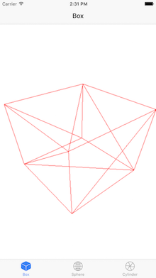

Ionic2 Three.js Custom Component
===============================

This is a sample Ionic2 App with custom component based on Three.js.




Install Node dependencies
------------------------

    $ yarn install

Running
-------

Local browser:

    $ ionic serve

iOS:

    $ cordova platform add ios --nofetch
    $ ionic cordova emulate ios

Android:

    $ cordova platform add android --nofetch
    $ ionic cordova emulate android

Create your own custom app
--------------------------

Ensure you have node, npm and ionic installed and updated.

Then, create a new App and add Three.js as a dependency:

```
$ ionic start ionic-threejs
$ cd ionic-threejs
$ npm install three --save
$ npm install @types/three --save
```

Copy components/scenegraph folder to your components folder

```
$ cp -R components/scenegraph [your components folder]
```

Add <scenegraph> tag where you want to include the SceneGraph component:

```html
<ion-content>
  <scenegraph geometry="box" #scenegraph></scenegraph>
</ion-content>
```

Modify your .ts file as the following:

```javascript
import { ViewChild, Component } from '@angular/core';
import { NavController } from 'ionic-angular';
import { SceneGraph } from '../../components/scenegraph/scenegraph'

@Component({
  selector: 'page-home',
  templateUrl: 'home.html'
})
export class HomePage {

  @ViewChild('scenegraph')
  sceneGraph: SceneGraph;

  constructor(public navCtrl: NavController) { }

  ionViewDidEnter() {
    this.sceneGraph.startAnimation();
  }

  ionViewDidLeave() {
    this.sceneGraph.stopAnimation();
  }

}
```

Edit your app.module.ts adding `SceneGraph` component to your declarations section:

```javascript
import { SceneGraph } from '../components/scenegraph/scenegraph'

@NgModule({

  declarations: [ /* Other components*/ SceneGraph ]

})
```

Run your project with and enjoy your 3D scenes:

```
$ ionic serve
```

