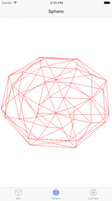
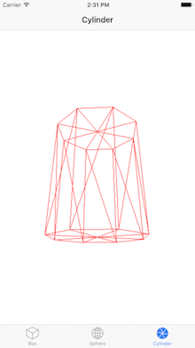

Ionic2 Three.js Custom Component
===============================

This is a sample Ionic2 App with custom component based on Three.js.





Running
-------

```
$ npm install
$ ionic serve
```

Create your own custom app
--------------------------

Ensure you have node, npm and ionic installed and updated.

Then, create a new App and add Three.js as a dependency:

```
$ ionic start ionic-threejs --v2
$ npm install three --save
$ typings install dt~three --save --global
```

Copy components/scenegraph folder to your components folder

```
$ cp -R components/scenegraph [your components folder]
```

Add <scenegraph> tag where you want to include the SceneGraph component:

```html
<ion-content>
  <scenegraph geometry="box" #scenegraph></scenegraph>
</ion-content>
```

Modify your .ts file as the following:

```javascript
import {ViewChild, Component} from '@angular/core';
import {NavController} from 'ionic-angular';
import {SceneGraph} from '../../components/scenegraph/scenegraph'

@Component({
  templateUrl: 'build/pages/box/box.html',
  directives: [SceneGraph]
})
export class BoxPage {

  @ViewChild('scenegraph')
  sceneGraph: SceneGraph;

  constructor(private navCtrl: NavController) {}
    
  ionViewDidEnter() {
    this.sceneGraph.startAnimation();
  }

  ionViewDidLeave() {
    this.sceneGraph.stopAnimation();
  }

}
```

Run your project with and enjoy your 3D scenes:

```
$ ionic serve
```
